## 一、   设计任务目的与要求 

1、  进一步掌握和利用C语言进行程设计的能力；

2、  进一步理解和运用结构化程设计的思想和方法；

3、 初步掌握开发一个小型实用系统的基本方法；

4、 学会调试一个较长程序的基本方法；

5、 学会利用流程图或N-S图表示算法；

6、 掌握书写程设计开发文档的能力（书写课程设计报告）；

## 二、   设计内容 

### 2.1   总体设计

说明包含几大功能模块

画出系统功能模块结构图和系统流程图

数据结构设计及用法说明

### 2.2    详细设计

函数名字：

函数功能：

数据结构设计描述，参数说明

实现过程：写算法或解决思路，贴(NS图或流程图)

 

学生奖学金管理系统流程图如下

 

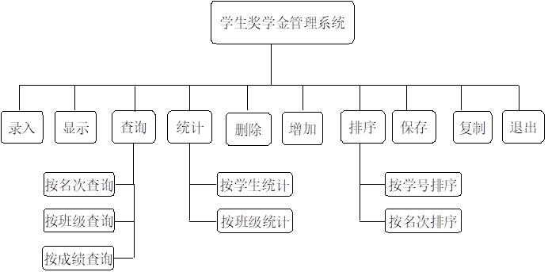

 

**使用到的结构体变量**：

~~~ 
struct Student

{   

   char Sid[10];
   char Sclass[20];
   char Sname[20];
   int Math;
   int English;
   int Physic;
   int Sum;
   int rank;
   struct Student;

}; 
~~~

**简介**：以上的结构体为学生奖学金管理系统的核心部分，是贯穿整个系统的灵魂。存储和读取都是以结构体的形式进行的，每个结构体包含着丰富的信息。

#### **第一板块：**学生成绩的录入

**使用到的函数有：**

Ø **int main()**；（控制主流程）

Ø **void ShowMenu()**；（显示主菜单）

Ø **struct Student in_stuNode();** (从键盘中输入的数据创建链表)

Ø **void Record(struct Student \*head); (**从链表中的数据写入文件)

**函数简介**：**先把用户输入的数据用链表储存起来，然后链表遍历，并写入文件中。**

**程序流程图分别如下**

**函数** **3**（ 创建stu链表）：用户输入表中相关信息（格式如流程图所示），输入学号为@输入结束。

​           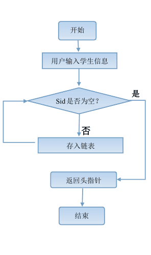

**函数** **4（ **stu链表写入文件）：成功写入文件， 在屏幕中输出Record ok！）

​            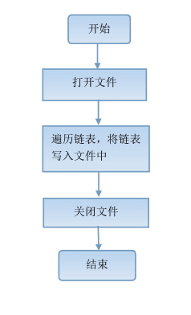

#### **第二板块：显示全部学生成绩信息**

 

**使用到的函数有：**

 

Ø **int main()；（控制主流程）**

Ø **void Show_stuNode()；（从链表中输出到屏幕）**

Ø **struct Student \ File_stuNode();（从文件中读取数据，建立链表）**

**函数简介**：**由于要经常对文件中数据操作，为了方便，把文件的数据存储到链表中，对链表的操作就是对文件中数据操作。** 

**函数** **2简介：**

**程序流程图分别如下**

 

​           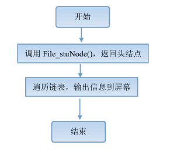

 

**函数** **3**简介：

​            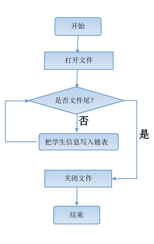 

 

#### **第三板块：条件查询学生信息**

**使用到的函数有：**

Ø **int main()**；（控制主流程）

Ø **void Search()**；（Search主菜单，控制流程）

Ø **void SearchByRank()**；（****按名次查询某学生的个人成绩****）

Ø **void SearchByClass()**；（****按班级查询****班级前3名学生的个人成绩****）

Ø **void SearchByScore()**；（****按成绩段查询某学生的个人成绩****)

Ø **void SearchBySid() NEW** **：ADD FILE**

Ø **void SearchByName() NEW** ：ADD FILE

Ø **struct Student \* File_stuNode();**（从文件中读取数据，建立链表）

 

**程序流程图分别如下**

**函数** **3**简介：

​          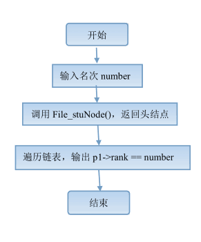

 

**函数** **4**简介：

​      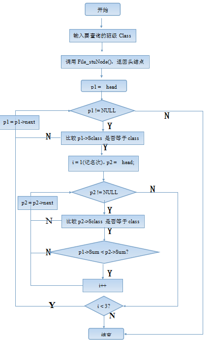

**函数** **5**简介：

​         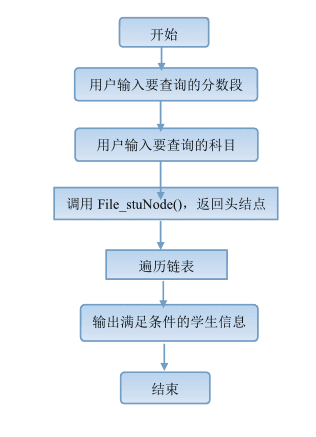

 

 

#### **第四板块：条件统计学生信息**

**使用到的函数有：**

Ø **int main()****；（控制主流程）**

Ø **void Statistics()****；（****统计主菜单，控制流程****）**

Ø **void StatByStu()****；（****按学生****统计所有人的总分****）**

Ø **void StatByClass()****；（****按班统计每个班的总分****）**

Ø **void StatByProject()****； NEW ：ADD FILE**

Ø **struct Student \* File_stuNode();****（从文件中读取数据，建立链表）**

**函数3简介**：

​           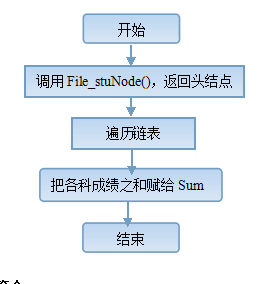

**函数4简介**：

​        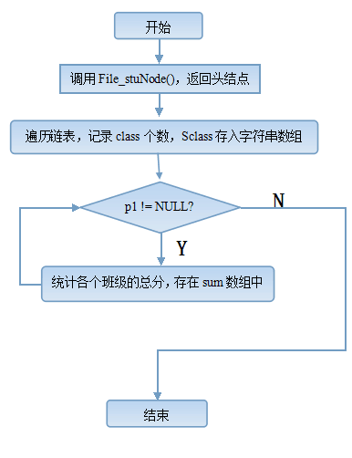

 

#### **第五板块：删除学生信息**

**使用到的函数有：**

Ø **int main()**；（控制主流程）

Ø **struct Student \* File_stuNode();**（从文件中读取数据，建立链表）

Ø **void Delete()**；（删除学生信息）

Ø **void Record(struct Student \*head); (**从链表中的数据写入文件)

 

**函数 3简介**：

   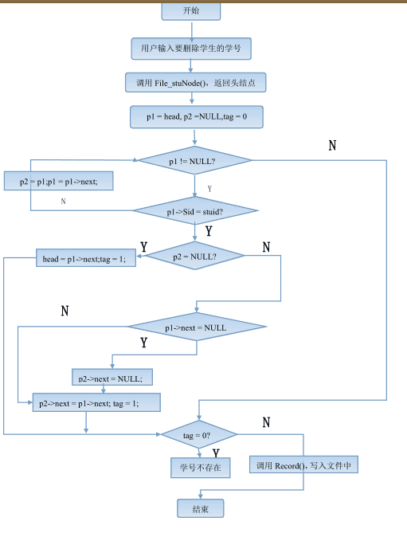

 

 

#### **第六板块：添加学生信息**

**使用到的函数有：**

Ø **int main()****；（**控制主流程**）

Ø **void Add()****；（调用其他函数，完成添加功能）

Ø **struct Student \* in_stuNode(); (从键盘中输入的数据创建链表)**

Ø **struct Student \* File_stuNode();**（从文件中读取数据，建立链表）

Ø **void Record(struct Student \*head); (**从链表中的数据写入文件)

**函数简介**：

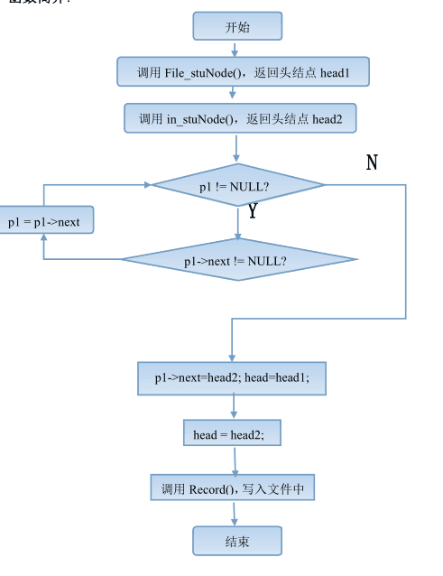

#### **第七板块：按条件排序**

**使用到的函数有：**

Ø **int main()**；（****控制主流程****）

Ø **struct Student \* File_stuNode();**（从文件中读取数据，建立链表）

Ø **void ShowSort();(** **控制sort 流程)**

Ø **void ShowSortBy()(**调用 sort 函数，显示结果)

Ø **struct Student ** SortByRank(struct Student \*head)（按名次排序）

Ø **struct Student \* SortBySid(struct Student \*head)**（按学号排序）

Ø **void Record(struct Student \*head); (**从链表中的数据写入文件)

 

 

**函数 5 简介**：

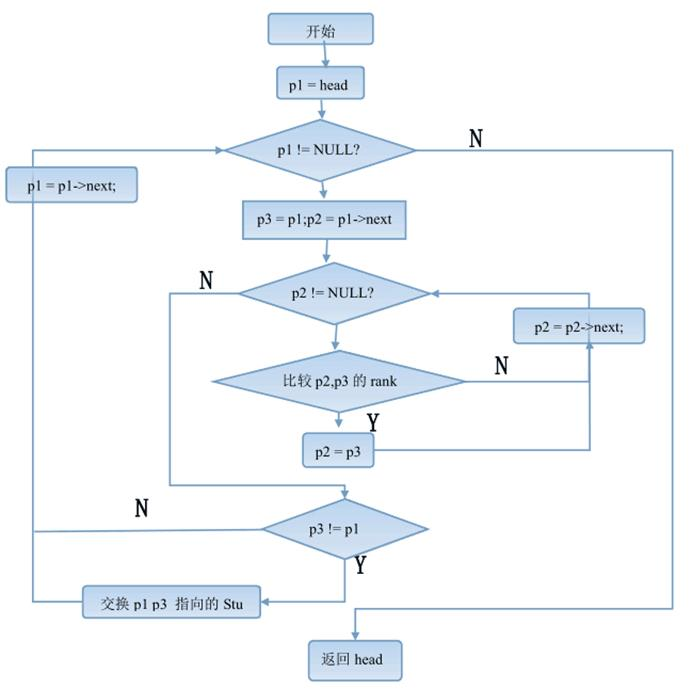

 

 

 

 

 

#### **第八板块：保存文件**

 

**使用到的函数有：**

Ø **int main()**；（**控制主流程**）

Ø **void SaveFile()**；（调用函数，保存文件）

Ø **struct Student \* File_stuNode();**（从文件中读取数据，建立链表）

**函数简介**：

 

​       

#### **第九板块：复制文件**

**使用到的函数有：**

Ø **int main()**；（**控制主流程**）

Ø **void CopyFile()****；（将文件1复制到文件2）

**函数简介**：

​    

 

   

 

 

 

 

 

 

## 三、   实验结果与数据分析

 图中应反映各种情况，说明图中表达的数据含义

图中应看到输入数据和输出结果 

### **第一板块：**

**一运行会出现主菜单**

**输入错误会提示**

用户输入学生信息界面

 

 

### **第二板块：**

 

 

 

### **第三板块：**

 

（必须先进行排名）

 

输入名次后 会把所有同名次的学生信息输出

输入班级后 会把班级前三名的学生信息输出

 

 

 

有Math ，English， Physics 三科成绩

 

 

输入分数段 ，如果输入 90-80 会提示错误

 

 

没有找到 符合条件 会输出 no found the student

 

 

 

### **第四板块：**

 

执行完操作一后， 在 C盘目录下 student.txt可以看到每个学生成绩总分

 

 

执行完操作一后， 在 C盘目录下 student1.txt 可以看到班级总分那一列 有总分了

 

 

 

### **第五板块：**

 

**输入 学号**

 

可以在 option 2 下看到 学号为201501001 的学生信息没有了

 

### **第六板块：**

操作跟学生成绩录入一样， 可以添加多个学生

|      |                           |
| ---- | ------------------------- |
|      |  |

 可以在 option 2 下看到 学号为201501001 的学生信又再增加回来了

 

 

 

### **第七板块：** 

**执行完成操作1 可以看到**

**学生信息 按 名次由高到低 排序**

 

**执行完成操作2可以看到**

**学生信息 按 学号 由 低 到高 排序**

 

 

### **第八板块：**

**输入 你想保存的的文件的文件名**

 

**在 C：下可以看到 以保存**

 

### **第九板块：**

**输入 你想保存的文件名**

**输入你的文件 副本名**

**在 C：下可以看到 以保存**

 

## 四、   问题分析

**1、用fwrite（）输入文件，用Txt打开乱码？**

**因为fwrite（） 是用二进制写入文件的，而txt记事本是以Ascll码翻译的，故显示是乱码。**

**2、在TC 下fopen（）打开文件失败，一直返回空指针？**

**因为TC是在虚拟C:下 ，存到D：盘下会找不到**

**3、free（）** 

## 五、   体会，总结

课程设计完成了哪些功能，有没有什么扩展功能 还有哪些地方需要改进，及通过两周的课程设计有何收获，调试程序的体会等

这次课程设计让我学到了很多东西，感受也颇多，首先就是刚拿到题目的时候，心想了一下觉得不是很难，然后我还遇到一些当时让我匪夷所思的问题，这个问题时我从来没有遇到过的，那就是关于free的问题。因为之前没有free掉节点的习惯，但后来发现这个是有必要的，所以我就开始尝试free没用的内存，于是问题就来了。刚开始我愚蠢的认为free就是直接把定义的指针free掉就好了……例如定义了*p1,*p2，我就直接free掉p1,p2.就以为链表所有占用的临时内存就释放掉了。Free不正确这会导致灾难性的后果，我的系统经常用着用着就卡死不动，起初我认为是死循环，但是我分布运行也会突然卡死，有时分布运行又可以通过这个函数，但跳出这个函数就又卡死了！我当时真的是觉得无比的奇怪，冷汗都吓出来了。我初步认为是电脑的问题，于是我换舍友的电脑试，居然有时卡死有时又正常……更让我想不通。后来认为是Tc的问题，想找个有Vc的人去他电脑里试试这个程序会不会卡死。那天去上课会回来，我仔细分析了一下，以前不会出现的问题而现在出现了，应该不是Tc的问题，毕竟它也是经过20年考验的，所以我就想了一下自己的代码与之前有什么不同，我发现就是比平常free频繁很多，所以我把free注释掉，结果运行就正常了，我很奇怪，于是上网查结果还真是这个问题！过几天刚好老师讲到了这个free的问题，心里感触很多呀。

还有就是关于格式的问题，系统的一条一条的横杠以及那些表格都是经过很多次的修改和校正的，虽然外观还是很难看，但是的却很难让它们对齐，伤透脑筋了。总之这次课程设计给了我很多启示吧，感触挺多的，自己也很努力很认真的完成了，虽然做出来的效果很一般，但是也算给自己的大一的C学习划伤一个圆满的句号吧。

## 六、   参考文献 

**C程序设计（谭浩强 编著）**

**C 程序设计（第四版）学习辅导 （谭浩强 编著）**

**C程序设计语言（第二版 新版） （Brian Kernighan && Denis M.Ritchie著）**

**C语言入门经典（第四版） （Ivor Horton 著）**

****